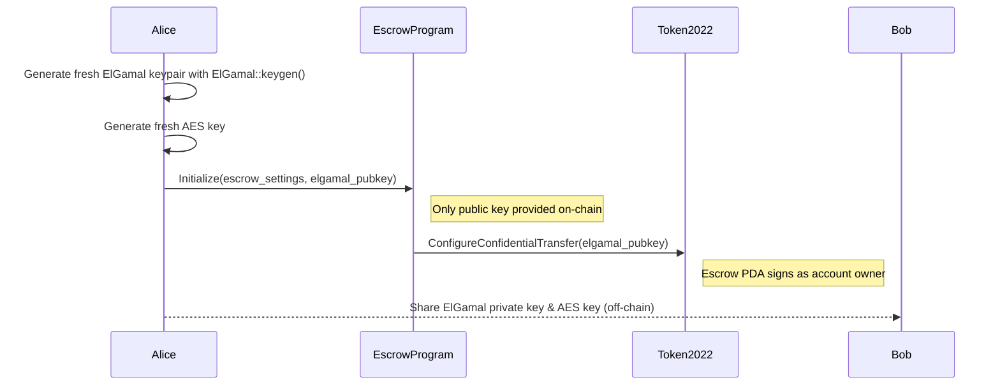
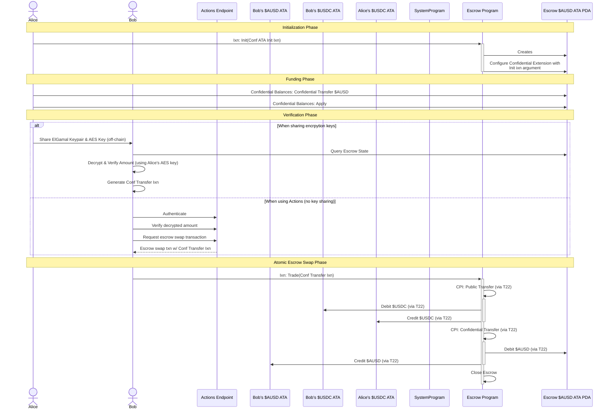
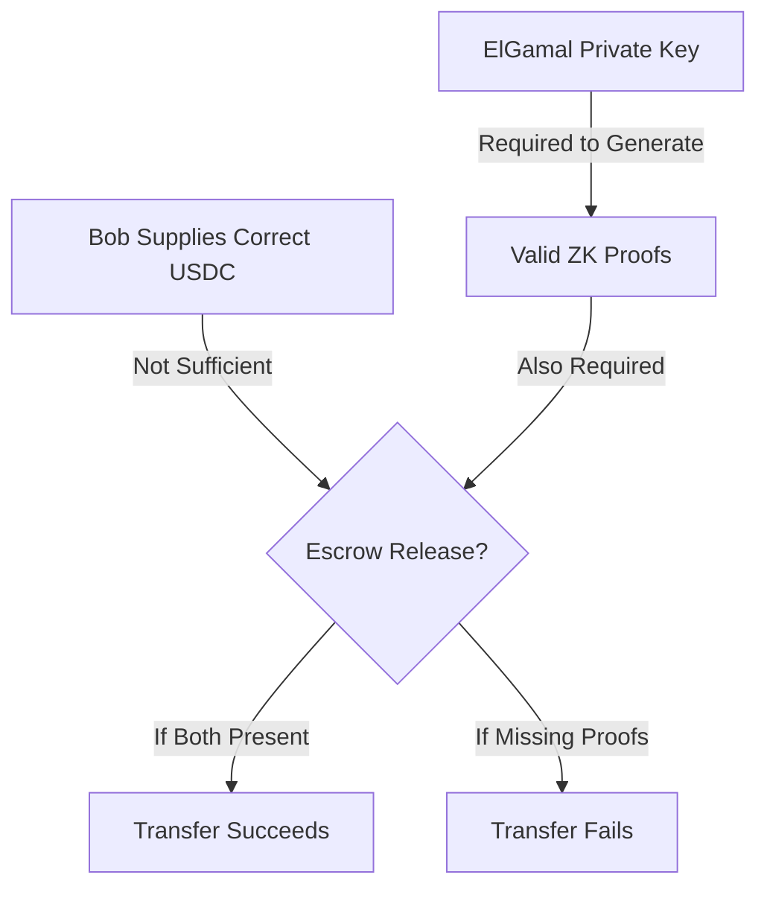

# ⚡ Confidential Escrow via Encryption Key Sharing - A Thought Experiment

> **Public Discussion Document - Theoretical Exploration**
>
> This document presents a theoretical exploration of confidential balance escrow mechanisms. It is published as a thought experiment to:
> - Inspire discussion around confidential balance primitives
> - Demonstrate how these primitives might work together in novel ways
> - Share intuition about the underlying mechanisms
>
> ⚠️ **Important**: All concepts presented here are theoretical and unproven. This is not a specification or implementation guide, but rather a starting point for discussion and exploration of possibilities within the confidential transfers design space.

## Use Case: Private Peer-to-Peer Token Exchange

In this scenario, Alice wants to trade 100 confidential $AUSD for 200 $USDC with Bob, while:
1. Keeping the trade amount hidden from the market
2. Allowing Bob to verify the exact amount
3. Completing the trade without requiring Alice to be online for the final step

## The Core Challenge

Confidential balances present unique challenges for escrow mechanisms:

**Encryption and Privacy Constraints:**
- Balances are encrypted on-chain 
- ZK proofs are required for transfers
- ElGamal keypair and AES key are needed to generate these proofs
- Transfer execution requires the sender's encryption keys

**On-Chain Program Limitations:**
- Programs cannot generate encryption keys:
  * RNG (required for key generation) is non-deterministic, breaking consensus
  * No secure way to store private key material on-chain
- ZK proof generation:
  * Computationally expensive, exceeding on-chain limits (needs benchmarking)
  * Impossible without access to private ElGamal and AES keys

## Basic Implementation Flow

### Key Generation and Setup



**Implementation Details:**

```rust
// Alice generates dedicated keys for this escrow
let escrow_elgamal_keypair = ElGamal::keygen();
let escrow_aes_key = AuthenticatedEncryption::keygen();

// Alice's transaction passes only public key on-chain
initialize_escrow(
    &alice_wallet,
    &escrow_program,
    EscrowSettings {
        expected_usdc_amount: 200_000_000,
        ausd_deposit_amount: 100_000_000,
        elgamal_pubkey: escrow_elgamal_keypair.pubkey(),
    }
);

// Inside escrow program - PDA configuration
let escrow_pda_seeds = [...];
let pda_signer = &[&escrow_pda_seeds[..]];
invoke_signed(
    &configure_confidential_transfer(
        token_program.key,
        escrow_token_account.key,
        escrow_pda.key,
        elgamal_pubkey,
        DecimalOrientation::Default,
        false, // No auditor
    ),
    accounts,
    pda_signer,
)?;
```

### Complete Trade Workflow



## Scaling Key Distribution

The basic flow above shows direct key sharing between Alice and Bob. However, for practical applications, more sophisticated key distribution methods are needed:

### Alternative Key Distribution Methods

1. **MPC-Based Distribution**
   - Instead of direct key sharing, use one-of-many MPC protocols
   - Keys are split into shares using threshold schemes
   - Each participant receives their share securely
   - Any single participant can reconstruct keys when needed
   - Scales efficiently for multiple potential counterparties

2. **Deterministic Key Generation**
   - Generate keys from seeds or signatures provided by multisig wallets
   - Example: Use multisig transaction signature as seed
   - Each party with access to the multisig seed/signature can derive the same keys
   - Ensures all multisig participants get identical encryption keys
   - No direct key transmission required
   - Particularly useful for DAO treasuries or institutional setups

Both approaches enable key sharing at scale while maintaining security:
- MPC approach suits dynamic participant groups
- Seed-based generation works well with existing multisig infrastructure
- Both methods reduce coordination overhead

### Critical Purpose of Encryption Keys

The sharing of encryption keys serves two essential functions:

1. **Verification Function** (Transparency Benefit)
   - Bob can decrypt and verify the escrowed amount
   - Provides transparency without compromising market privacy

2. **Execution Function** (Technical Requirement)
   - The ElGamal keypair is **mandatory** for the escrow to function
   - Without the private key, Bob cannot generate valid ZK proofs
   - Even with correct USDC payment, the transaction would fail without proofs



**Key Innovation**: This enables asynchronous execution without requiring Alice to be online during trade settlement.

## Technical Requirements and Mechanisms

### Token-2022 Program Requirements

1. **Account Ownership and Configuration**
   - Confidential extension must be configured by the account owner (Escrow PDA)
   - ElGamal public key is registered during configuration and cannot be changed
   - ZK proofs must be generated using the registered ElGamal private key

2. **Proof System Integration**
   - ZK proofs verify transfer amounts, sufficient balances, and balance updates
   - ElGamal proof system verifies proof validity without revealing amounts
   - Confidential transfers require both valid proofs and proper authority signatures

### Encryption Keys: Roles and Separation

| Key Type | Purpose | On-Chain Status | Security |
|----------|---------|-----------------|----------|
| ElGamal Public Key | Registered with token account | Stored on-chain | Not sensitive |
| ElGamal Private Key | Generates ZK proofs for transfers | Never on-chain | Highly sensitive |
| AES Key | Decrypts confidential balances | Never on-chain | Highly sensitive |

**Key Distinction**: 
- **Wallet Authority**: Controls transaction signing and account ownership
- **Encryption Keys**: Enable viewing confidential data and generating proofs
- **Program Authority**: PDA can sign for transfers but can't generate proofs without keys

## Security Model and Constraints

### Security Properties

1. **Key Isolation**
   - Dedicated keypair specific to this escrow
   - No relationship to Alice's main wallet or accounts
   - Limited exposure (only escrow funds affected if compromised)

2. **Program-Enforced Security**
   - Bob cannot bypass escrow program conditions
   - USDC verification independent of confidential proof validity
   - Escrow program controls when tokens can be released

### Implementation Constraints

1. **Technical Requirements**
   - Confidential extension must be configured before receiving tokens
   - Escrow program must implement proper PDA signing for CPIs
   - ZK proofs can approach transaction size limits
   - Off-chain key sharing requires secure channel

2. **Use Case Limitations**
   - Not suitable for open market orders (requires specific counterparty)
   - Requires some trust between participants
   - Not appropriate for complex multi-party protocols
   - Better for moderate amounts (fresh accounts with limited exposure)

## When to Use This Pattern

**Ideal For:**
- Private P2P trades with specific counterparties
- Trades requiring asynchronous completion
- Privacy-preserving exchanges with selective disclosure

**Avoid For:**
- Open market DEX orders
- Zero-trust requirements
- Complex DeFi compositions
- High-security, high-value transactions

## Conclusion

This encryption key sharing model represents an architectural pattern that balances:
- Confidentiality from the broader market
- Verification for specific counterparties
- Atomic execution without coordination overhead
- Program-controlled escrow security

By understanding the roles of encryption keys, ZK proofs, and on-chain program logic, developers can implement confidential escrow mechanisms that maintain most security properties while solving the coordination challenges inherent in confidential transfers. 